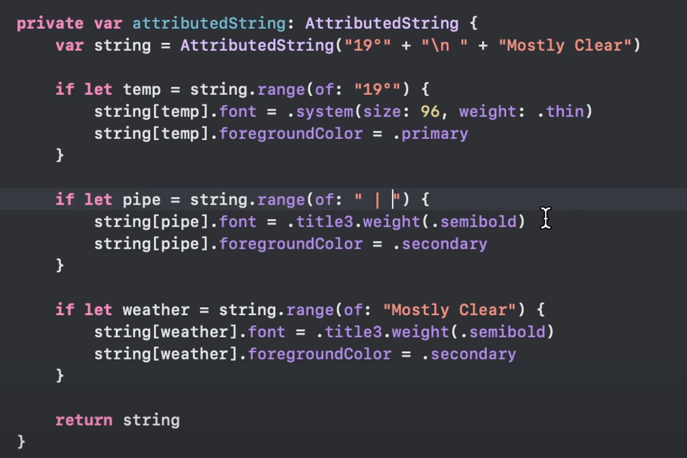

- [[swiftui]]
	- 默认 font 的尺寸对比
	- 
	- [[视频代码实例]]
		- #animation
			- [Animate an iOS app in SwiftUI - Full 3-hour course](https://www.youtube.com/watch?v=b8sP7AS0CAY)
				- #attributedString
					- 
					-
			-
- [[视频制作]]
	- #AE [7700字、110张图讲透AE「文字动画」，建议反复观看10遍！ - 哔哩哔哩](https://www.bilibili.com/opus/936910178907848785?spm_id_from=333.999.0.0)
	-